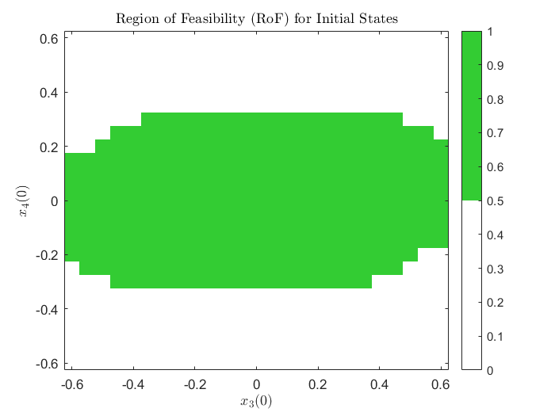
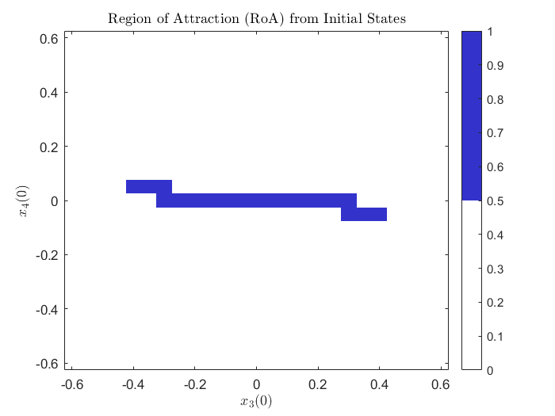
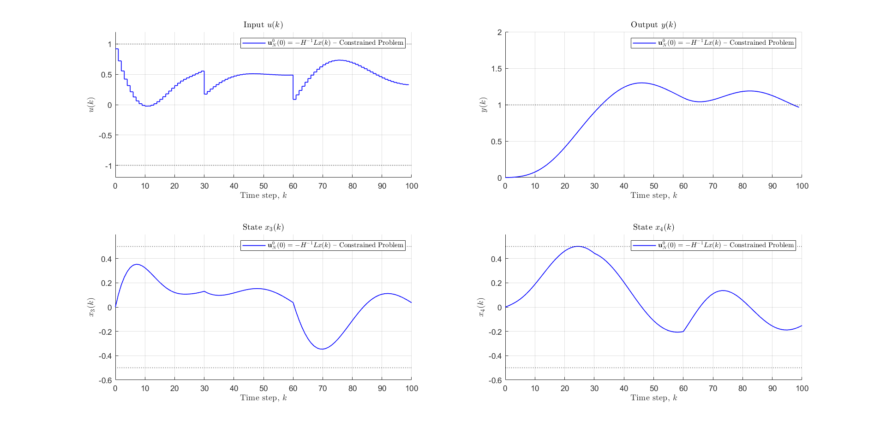
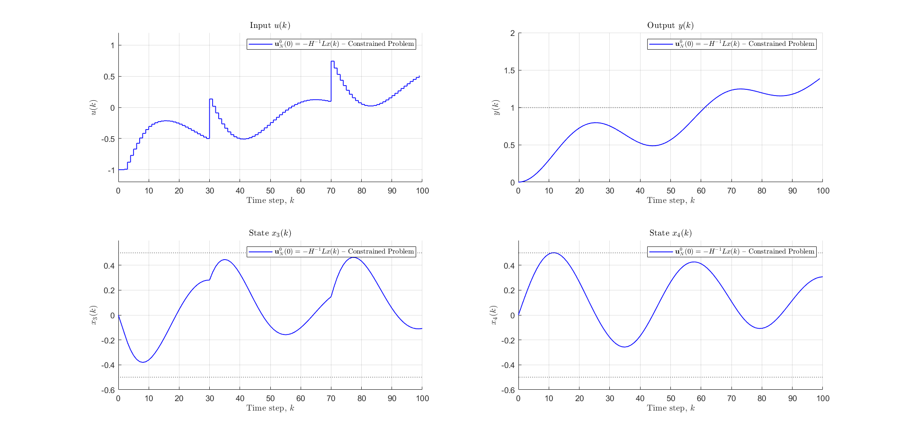

# LQ-MPC Design for Wie–Bernstein Two-Cart System

## Author
**Muzhaffar Maruf Ibrahim**  
School of Electrical and Electronic Engineering, University of Sheffield

---

## 🧠 Abstract

This project presents the design of a **Linear Quadratic Model Predictive Controller (LQ-MPC)** for a **two-cart spring-mass system** with uncertain parameters. This benchmark problem represents real-world systems like power grids, robotic manipulators, and spacecraft docking mechanisms.

The controller:

- Stabilizes applied force `uₖ` within constraints: `-1 ≤ uₖ ≤ 1`
- Maintains demand responses: `|x₃| ≤ 0.5`, `|x₄| ≤ 0.5`
- Achieves closed-loop stability in fewer than 10 time steps
- Ensures robustness against disturbances via optimal terminal cost design

---

## 🧾 Problem Statement

We consider the Wie–Bernstein two-mass spring system described by the continuous-time state-space model:

$$
\dot{x} = A_c x + B_c u + E_c d
$$

where \( x = [x₁, x₂, x₃, x₄]^T \) are positions and velocities of the carts. The system is subject to input and state constraints:

- `|u| ≤ 1`
- `|x₃| ≤ 0.5`, `|x₄| ≤ 0.5`

---

## 🎯 Control Objective

- Track steady-state targets under persistent disturbance
- Satisfy hard input/state constraints using QP formulation
- Minimize quadratic cost over a prediction horizon:
  

  

---

## ✅ Constraints

**Input Constraints:**

  

**State Constraints:**

  

---

## 🌍 Region of Feasibility (RoF)

The **Region of Feasibility** defines all initial states from which the MPC problem yields a feasible solution, satisfying all constraints during prediction.

- Figure below shows feasibility in x₃(0) vs. x₄(0) space:
  

  

---

## 🌐 Region of Attraction (RoA)

The **Region of Attraction** is a subset of RoF from which the controller not only produces a feasible trajectory, but also drives the system **asymptotically to the origin**.

- Only states within this region ensure **closed-loop convergence**:
  

  

---

## 📊 Performance Metrics

| Controller Type         | Cost (J) | ∑uₖ     | Ts (s) | Overshoot (%) |
|-------------------------|----------|----------|--------|----------------|
| Unconstrained           | 9.3189   | 132.95   | 5      | 71.17          |
| Input Constrained       | 20.946   | 47.617   | 5      | 1.54           |
| Input + State Constrained | 22.347 | 46.631   | 5      | 0.76           |

---

## 📈 Tracking with Disturbance & Reference Changes

Performance under step changes in disturbance/reference:

| Scenario               | Cost (J) | ∑uₖ   | Ts (s) | Overshoot (%) |
|------------------------|----------|--------|--------|----------------|
| Offset Tracking        | 7.3865   | 7.3865 | 0.1    | 9.42           |
| Reference Variation    | 92.369   | 14.16  | 10     | 0              |
| Disturbance Variation  | 117.57   | 21.94  | 10     | 34.88          |

---

## 📎 Figures

- **Tracking Performance:**

  

- **With Various Disturbances:**

  

- **With Various References:**

  

---

## 🧰 Implementation

The MATLAB code is split by task:

- `mpc_tasks_1_3.m`: Basic and constrained MPC
- `mpc_tasks_4_5_disturbance.m`: MPC under disturbance
- `mpc_tasks_4_5_reference.m`: MPC with reference variation

---

## 📚 References

> See full list in the PDF document (e.g., Bryson 1979, Wie & Bernstein 1992, Rossiter 2018, Morari et al. 1989, etc.)

---

## 📩 Contact

*Muzhaffar Maruf Ibrahim*  
[mmibrahim2@sheffield.ac.uk](mailto:mmibrahim2@sheffield.ac.uk)

---

